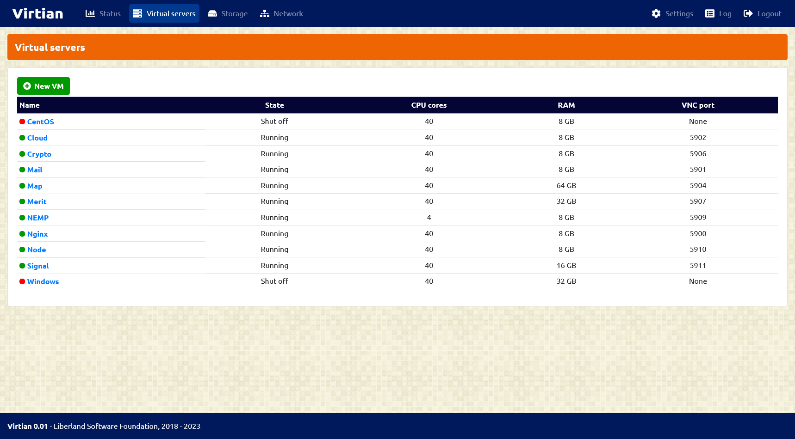

# About Virtian

**Virtian** is a web user interface for virtual servers management based on KVM. It is primarily designed for Debian Linux 11.x, but it might work on other Linux distributions.

## Features

- Virtual server management
- Storage pools and volumes management
- Network management
- Server resources monitoring

## Installation

**Warning** - The following procedure is designed for clean installation of your server only. Do not install it on working environment, otherwise you might lose some of your data !!!

1. Download and install the latest version of **Debian** netinst ISO file from here: https://www.debian.org/CD/netinst/
2. Log in as **root** and run:

```sh
apt-get -y install git
git clone https://github.com/libersoft-org/virtian.git
cd virtian
./install.sh
reboot
```

3. Access Virtian web user interface via web browser on **https://[YOUR-SERVER-IP]**
4. Create the exception for unsigned https certificate in your browser
5. Log in with password **"admin123"**

## Settings

You can set some basic properties (password, web template path, installation ISO path etc.) by editing **/var/www/settings.php** file.

## Screenshots

- Desktop:



- Mobile:


## License

This software is developed as open source under [**Unlicense**](./LICENSE).

## Contact info

- Web page: **https://virtian.org**
- E-mail: **info@virtian.org**

## Donations

Donations are important to support the ongoing development and maintenance of our open source projects. Your contributions help us cover costs and support our team in improving our software. We appreciate any support you can offer.

To find out how to donate our projects, please navigate here:

[](https://libersoft.org/donations)

Thank you for being a part of our projects' success!
